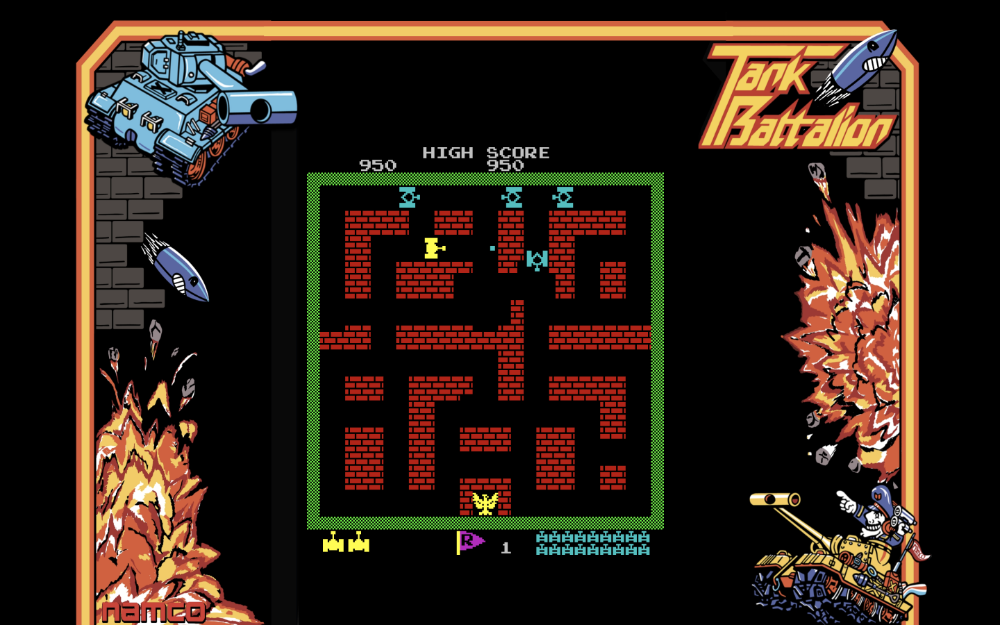
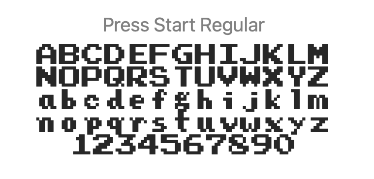
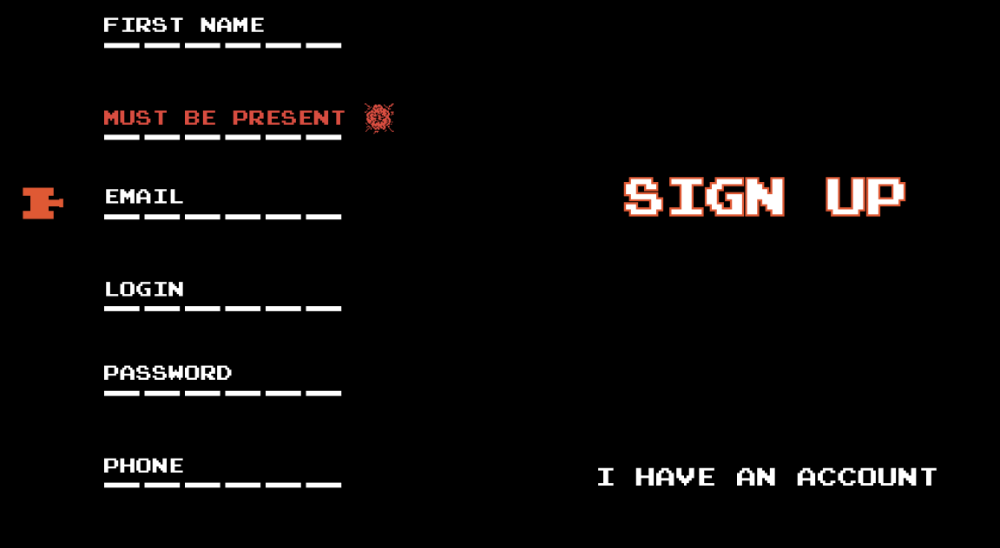

# Tank Batallion 1980

The task is to reproduce the original arcade game ["Tank Batallion"](https://en.wikipedia.org/wiki/Tank_Battalion), released by Namco in 1980.

## Running the project locally

- `webpack serve`
- OR `make docker-serve`, then visit `localhost:8000`

## Gameplay references

- [Original gameplay video](https://www.youtube.com/watch?v=Qv67z84ypS0)
- [Reference JS code](https://github.com/kon-rad/tank-battalion)
- [Original description, rules, and level design](https://strategywiki.org/wiki/Tank_Battalion)

## Mockups

Figma WIP is accessible [here](https://www.figma.com/file/vwAWkh6r79NBj2awpUnmBT/Tank-Batallion?node-id=1%3A61)

## Design language

#### Font

Press Start Regular

#### Background and "frame"

All pages have pure **black** as background. All screens have a decorative "frame" with the original art from the arcade box design (see Figma).

#### Forms, buttons and validations

Forms and inputs should be done as reusable React componenets right from the start. Here's the form design direction, note validation error and the tank icon following the active field.

Forms should be "assymetric", with the CTA and secondary buttons _on a side_ to mimic the lack of space on arcade screen.

## Developer notes

- As the original assets are nothing but crude squares ("pixels"), we can convert them to vector by manually tracing them in Figma, exporting to SVG and then converting that SVG to direct Canvas painting instructions. This will significantly reduce the size of the game and open new possibilities for development (e.g., a "tank" is a self-contained JS class that can draw itself on canvas).

Example:

